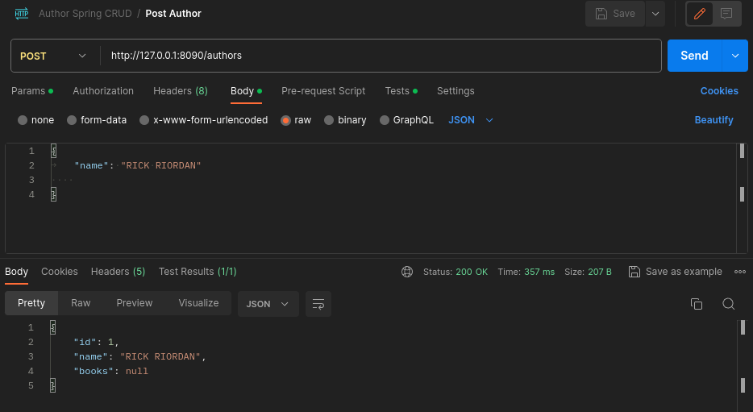
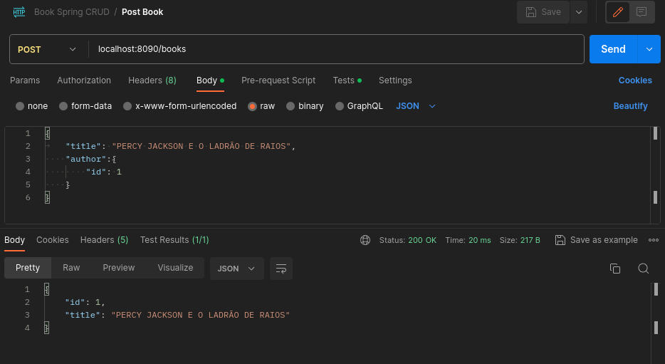
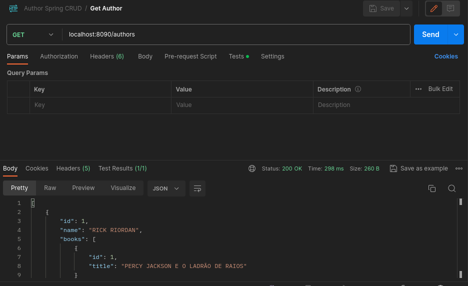
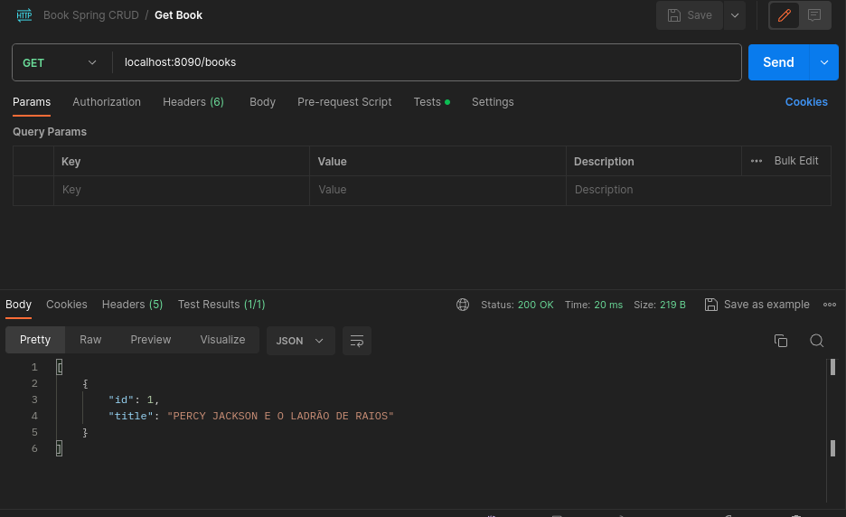
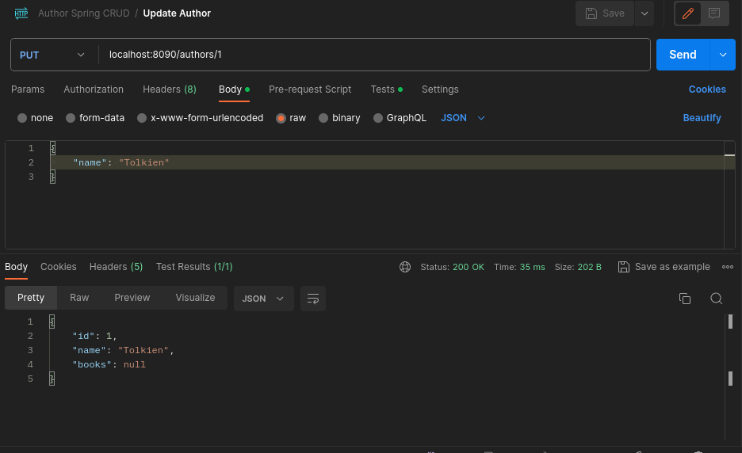
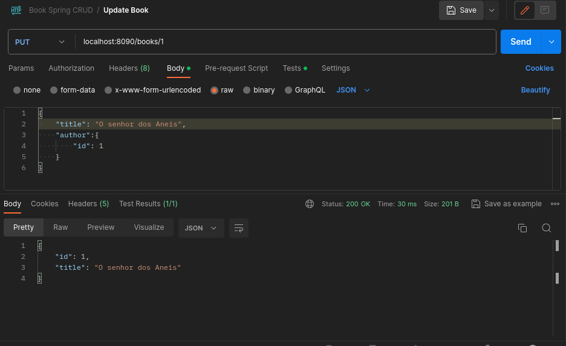
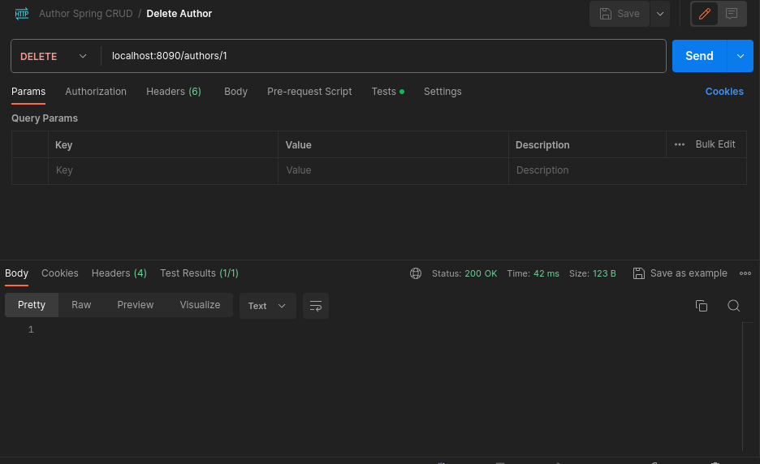
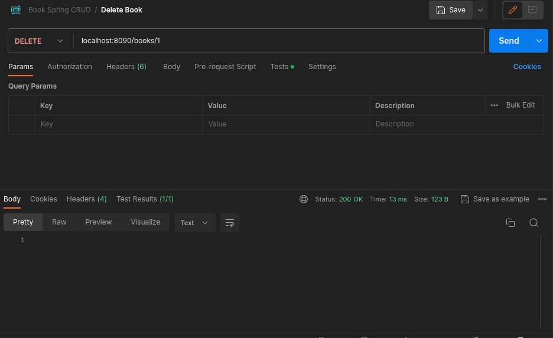

# Trabalho CRUD da disciplina de Programação Orientada a Objetos em Java

**Aluno:** Francisco Alan Oliveira da Costa Alves

**Matrícula:** 202202543942

Este projeto CRUD foi desenvolvido como parte da disciplina de Programação Orientada a Objetos em Java. Utiliza o framework Spring e o sistema de gerenciamento de dependências Maven, com uma base de dados H2, para servir como uma API REST.

### Author (Relação Um-para-Muitos)
- **Name:** Nome do autor
- **Books:** Lista de livros escritos pelo autor

### Book (Relação Muitos-para-Um)
- **Id:** Identificador único
- **Title:** Título do livro
- **Author:** Autor do livro

## Como Usar o Postman

Você pode testar as operações da API CRUD usando o Postman, um cliente HTTP que permite interagir com APIs. Abaixo estão os endpoints e operações disponíveis:

### Criar um Novo Autor (POST Author)
- Cria um novo autor na base de dados.
- Endpoint: `POST localhost:8090/authors`

### Criar um Novo Livro (POST Book)
- Cria um novo livro na base de dados.
- Endpoint: `POST localhost:8090/books`

### Recuperar Informações de um Autor (GET Author)
- Recupera informações de um autor pelo ID.
- Endpoint: `GET localhost:8090/authors/{id}`

### Recuperar Informações de um Livro (GET Book)
- Recupera informações de um livro pelo ID.
- Endpoint: `GET localhost:8090/books/{id}`

### Atualizar Informações de um Autor (PUT Author)
- Atualiza informações de um autor existente.
- Endpoint: `PUT localhost:8090/authors/{id}`

### Atualizar Informações de um Livro (PUT Book)
- Atualiza informações de um livro existente.
- Endpoint: `PUT localhost:8090/books/{id}`

### Excluir um Autor (DELETE Author)
- Exclui um autor da base de dados pelo ID.
- Endpoint: `DELETE localhost:8090/authors/{id}`

### Excluir um Livro (DELETE Book)
- Exclui um livro da base de dados pelo ID.
- Endpoint: `DELETE localhost:8090/books/{id}`

**Lembre-se de configurar corretamente o Postman com as informações da API e utilize os endpoints acima para realizar operações de criação, atualização e exclusão de autores e livros (Authors/Books).**
